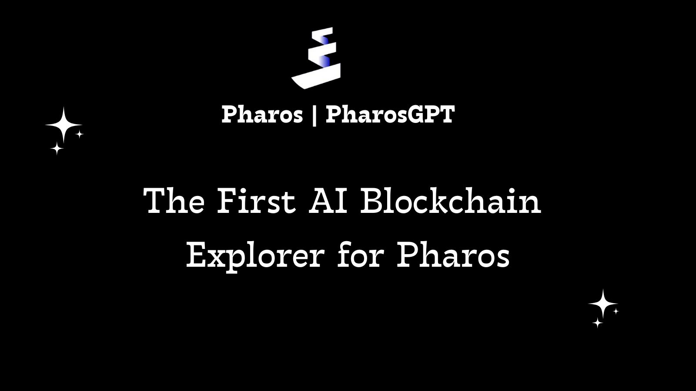
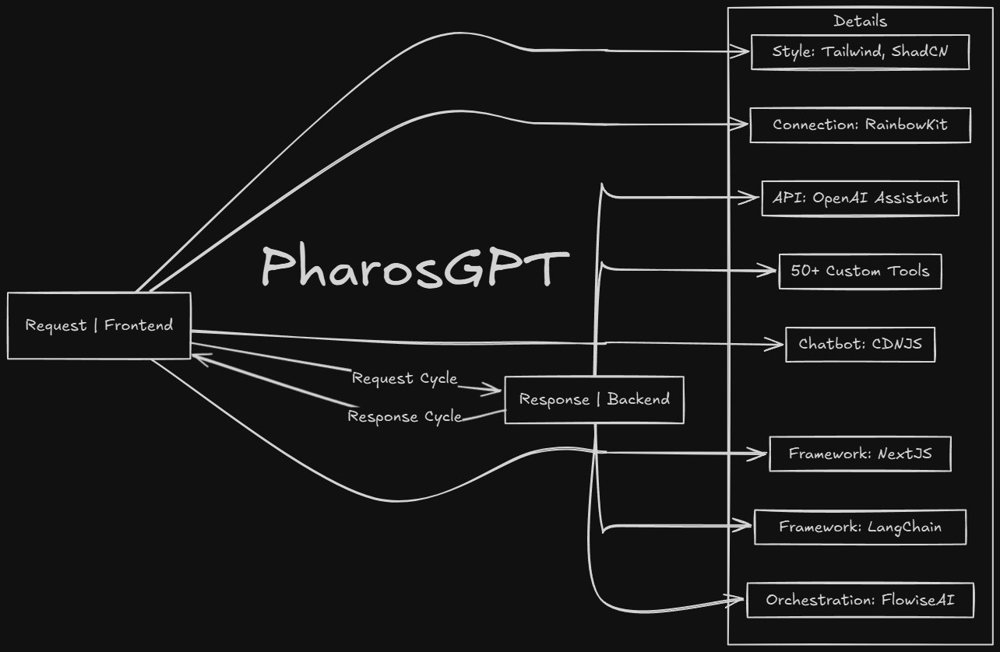

# > PharosGPT 🤖

## Introduction

- PharosGPT is the First AI-Powered Blockchain Explorer for Pharos ⚡

PharosGPT is an smart AI Assistant built for the Pharos Community & Developers. It is designed to provide answers to the real-time blockchain (on-chain) data.

- **The Problem** 🤔
  - Blockchain data is complex and hard to understand
  - Even experienced users struggle with real-time chain analysis
  - Technical jargon and raw data make it difficult to extract insights

- **The Solution** 🚀
  - PharosGPT: An AI-powered assistant for the Pharos ecosystem
  - Makes blockchain data accessible to everyone
  - Helps developers understand smart contracts and build better dApps
  - Guides community members through their blockchain journey

PharosGPT is built with the OpenAI, LangChain, Flowise, Wallet Connect, and so much more.

## Features

👉🻠Connect with Wallet to access the application.  
➡️ One time Name & Email require to access the Application.  
🯠Personalized answers for community & developers.  
🔥 Query the real-time blockchain data using natural language.  
🕒 Real-time updates from Internet.  
👨‍💻 Chat via CUI (Conversational User Interface).  
🤠Voice functionality for easy interaction.  
👠Provide Feedback.  
☑️ 12 Limit Messages per 24 hours.  

## Benefits

- Enhances community & developer experience.  
- Keeps the Web3 community informed.  
- Makes Web3 more accessible.  
- Assist greater engagement and Web3 space development.  

## Tech Stack | Request & Response Cycle

- **RainbowKit**: To connect/login the users with the Web3 wallet on Pharos.
- **Blockscout for on-chain data**: Used 50+ API Endpoints to build the custom tools (Function Calling) to get different kinds of data from the explorer.
- **OpenAI Assistant APIs**: Powers the natural language processing abilities to deliver accurate responses and maintain a conversational style with (function calling, code interpreter, and file search).
- **FlowiseAI**: Customized LLM orchestration flow tool, powered by LangChain.
- **Next.js, TypeScript, TailwindCSS**: Provides a seamless, dynamic user interface with a consistent design.
- **OpenAI GPT-4o and Moderation APIs**: Handles advanced chatbot responses and content moderation.
- **Google Custom Search API**: Allows the chatbot to fetch relevant information online to provide up-to-date answers.
- **Custom Training Data with Prompt Engineering**: Ensures precise responses through well-crafted prompts and curated data.
- **OpenAI Whisper API for Speech-to-Text**: Supports speech recognition to deliver a multi-modal experience.
- **LangSmith API for Chatbot Analysis**: Analyzes chatbot interactions for optimization and refinement.

### **=> How Everything is Connected? (Flowise Flow Chart)**

- [Flowise GitHub Repository](https://github.com/flowiseai/flowise) - Backend service deployed on Render, programmatically integrated with the chatbot UI frontend on Vercel through REST APIs.
- [FlowiseChatEmbed GitHub Repository](https://github.com/flowiseai/FlowiseChatEmbed) - Chatbot interface implementation, delivered through Content Delivery Network (CDN) for optimal performance.

## Quick Links

- [Live Application](https://pharosgpt.vercel.app/) - Try PharosGPT in action
- [Assistant Training Prompts](./docs/prompt_engineering.md) - View the prompts used to train the AI assistant
- [API Documentation](./docs/api_endpoints_overview.md) - Technical details about API endpoints and custom tools
- [Example Queries](./docs/advance_user_queries.md) - See real-world examples of user queries and API mappings
- [Custom Tools](./docs/custom_tools.md) - View the custom tools created to extract on-chain (real-time) data
- [Question & Answer](./docs/question_answer.md) - View the questions & answers documentation

## Future Improvements

**Expanded Knowledge Base:** Improve the ***PharosGPT*** by incorporating additional Pharos resources data to provide more comprehensive and technical answers into simple words. 

**Enhance Community Analytics:** Access real-time community sentiment about the Pharos projects through metrics from X and other social platforms for multiple use cases. 
